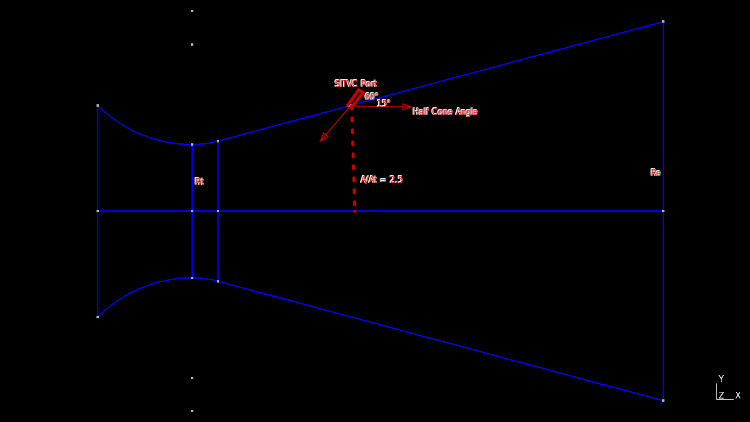
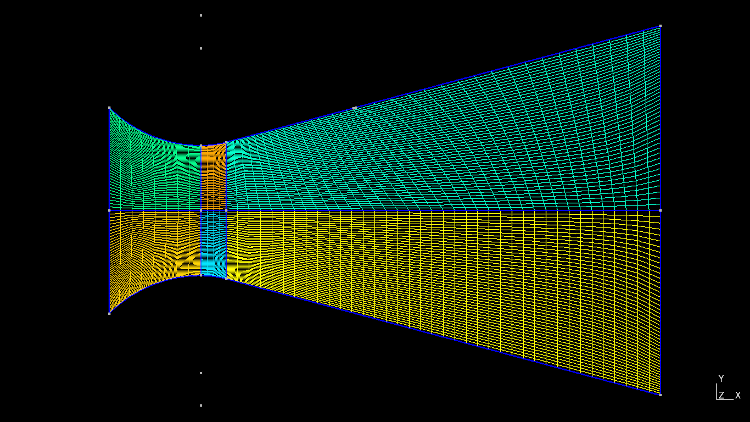
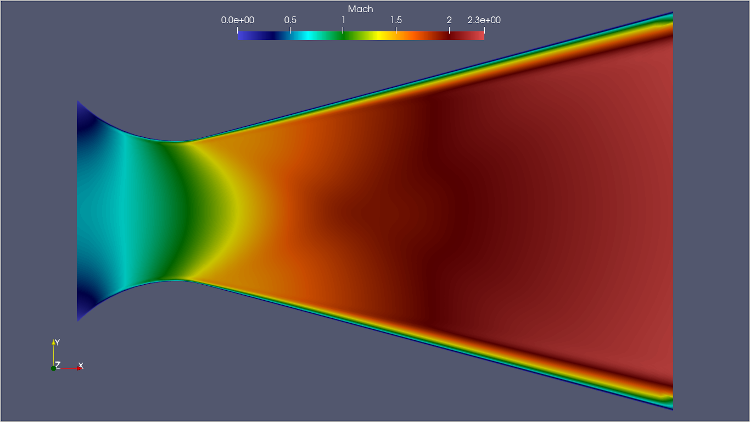
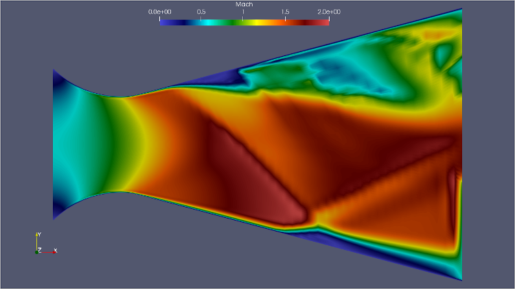
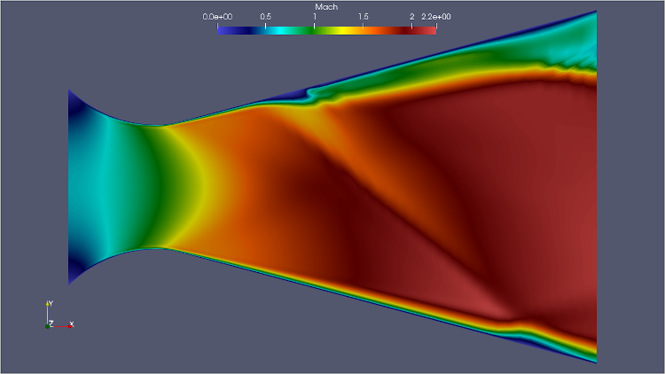
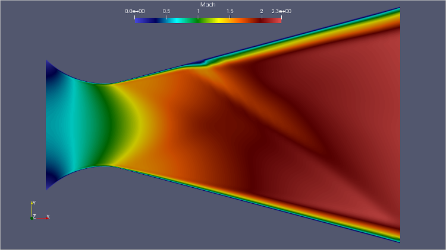

# CFD Flow Simulation for PSLV Nozzle with SITVC (RANS-SST)
> Flow simulation of PSLV-P1 Nozzle with secondary injection thrust vector control (SITVC).  
   

## Table of contents
* [General info](#general-info)
* [Screenshots](#screenshots)
* [Setup](#setup)
* [How to run ](#how)
* [References](#references)
* [Updates](#updates)
* [To-do list](#to-do)

## General info      
>   
* The technique of secondary fluid injection into the rocket nozzle as a means to obtain the forces for thrust vector control (TVC).   
* PSLV S139 SITVC port details (60° into the flow where A/At = 2.5)   
*    
* Gmsh geometry file is written using python wrapper and generates the .su2 file required for the SU2 solver.    
* SU2 configuration is set with RANS (Governing equations - Reynolds-averaged Navier-Stokes) and SST (Turbulence model - Shear Stress Transport).   
* RANS-SST is very sensitive to mesh geometry, size, CFL number, multigrid parameters.    

**Script features**     
>
1.  Python script 'trans_nozzle_structured.py' generates structured mesh with the SITVC Port on top side of the cone in .su2 format directly.   
2.     
3. Generated files are bell_nozzle_cgrid.su2 and  conical_nozzle_cgrid.su2.

## Screenshots

**PSLV 1st stage Nozzle**   
>    
**NO SITVC**    
   
&nbsp;   
&nbsp;   
**SITVC-Injection at 10 MPa**    
   
&nbsp;   
&nbsp;   
**SITVC-Injection at 8 MPa**    
     
&nbsp;   
&nbsp;   
**SITVC-Injection at 6 MPa**    
     

## Setup
Tested the code on Linux based setup.    
>   
1. Gmsh (Version-4.7.1) with python module - Mesh generation
2. SU2 (Version-7.1.0) - CFD solver 
3. Paraview (Version-5.7.0) - flow visualization  

&nbsp;    
SU2 appears in two flavours. Single core/cpu version or MPI version for parallel computations.    
If you have multi-core processor, then MPI version speeds up the computation. You need to install MPICH   

## How to run   
> Download the files.       
> 
> Generate mesh   
> 
* Verify and install required modules    
* run `python trans_nozzle_structured.py`.    

> Single CPU mode:   
> 
* Execute `SU2_CFD nozzle_rans_sst.cfg` on terminal.    
* Open flow.vtu file through Paraview.    

> Parallel computation mode:   
> 
* Execute `mpirun -n 2 SU2_CFD nozzle_rans_sst.cfg` on terminal. (2-cores will be used)   
* Open flow.vtu file through Paraview.  

## References   
1.  Development of Nozzle for PSLV Booster   
[ https://arc.aiaa.org/doi/pdf/10.2514/6.1991-2588 ]   
2.  Analysis of Performance of a Hot Gas Injection Thrust Vector Control System    
[ https://www.researchgate.net/profile/Hanasoge-Mukunda/publication/245434146_Analysis_of_performance_of_a_hot_gas_injection_thrust_vector_controlsystem/links/5fd755d492851c13fe850cb8/Analysis-of-performance-of-a-hot-gas-injection-thrust-vector-controlsystem.pdf ]
3. Comparison of Euler and Navier-Stokes solutions for nozzle flows with secondary injection  
[ https://arc.aiaa.org/doi/pdf/10.2514/6.1996-453 ]  

## Updates     
*  

## To-do list  
*

